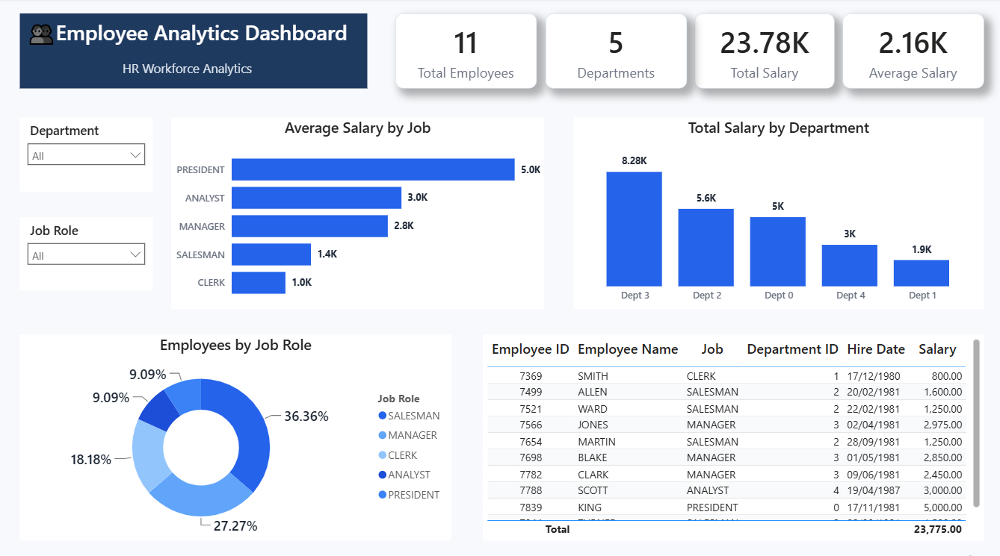

# 👥 Employee Analytics Dashboard

<p align="center">
  
</p>

An interactive **Business Intelligence Dashboard** built with **Power BI** using data extracted from a **PostgreSQL** database. The project combines **SQL**, **Power Query**, and **Power BI** visualizations to analyze employee information, salary distribution, job roles, departmental performance, and hiring insights, enabling HR teams and business managers to make informed workforce decisions.

---

# 📑 Table of Contents

- Project Overview
- Business Objectives
- Dashboard KPIs
- Dashboard Layout
- Tools & Technologies
- Dataset
- SQL Analysis
- Key Features
- Business Questions Answered
- Key Business Insights
- Skills Demonstrated
- Business Value
- Repository Structure
- How to View the Dashboard
- Future Improvements
- Author

---

# 📌 Project Overview

Employee analytics plays a vital role in helping organizations understand workforce composition, salary structures, departmental performance, and hiring patterns.

This project combines **PostgreSQL**, **SQL**, and **Power BI** to transform employee data into an interactive dashboard that enables HR professionals and decision-makers to explore workforce metrics, monitor payroll distribution, analyze job roles, and support data-driven business decisions.

---

# 🎯 Business Objectives

- Monitor workforce statistics.
- Analyze salary distribution across job roles.
- Compare departmental payroll expenses.
- Understand employee distribution by job role.
- Explore hiring patterns.
- Support HR decision-making through interactive reporting.

---

# 📊 Dashboard KPIs

- Total Employees
- Total Departments
- Total Salary
- Average Salary

---

# 🛠️ Tools & Technologies

- PostgreSQL
- SQL
- Power BI Desktop
- Power Query
- Data Modeling
- Data Visualization
- Interactive Reporting

---

# 📊 Dashboard Layout

The dashboard consists of a single interactive report page designed to provide a comprehensive overview of workforce performance.

### Dashboard Components

- Executive KPI Cards
- Average Salary by Job Role
- Total Salary by Department
- Employee Distribution by Job Role
- Employee Details Table
- Department Filter
- Job Role Filter

---

# 📂 Dataset

The dashboard is built using an Employee dataset stored in PostgreSQL.

The dataset includes:

- Employee ID
- Employee Name
- Job Role
- Department ID
- Hire Date
- Salary

---

# 🗃️ SQL Analysis

The project includes **11 SQL business questions**, organized into three scripts for better readability and maintenance.

### 📁 01_Salary_Analysis.sql

Covers salary and payroll analysis, including:

- Total payroll by department
- Department payroll ranking
- Average salary by job role
- Salary comparison using Window Functions
- Highest and lowest salary within each job role

### 📁 02_Workforce_Analysis.sql

Focuses on workforce distribution and employee analysis:

- Employee count by job role
- Previous and next employee based on salary ranking
- Employee hiring sequence

### 📁 03_Hiring_Analysis.sql

Analyzes hiring trends over time:

- Hiring gap between employees
- Hiring interval calculations

---

# 📊 Key Features

- Executive KPI Cards
- Interactive Slicers
- Salary Analysis
- Department Comparison
- Job Role Distribution
- Employee Detail Table
- SQL Data Extraction
- Power Query Data Transformation
- Interactive Dashboard Design

---

# ❓ Business Questions Answered

- What is the total payroll expense for each department?
- Which department has the highest payroll cost?
- What is the average salary for each job role?
- Which job roles receive the highest salaries?
- How are employees distributed across different job roles?
- Who are the previous and next employees in the salary ranking?
- What is the hiring sequence of employees?
- What is the hiring gap between consecutive employees?
- Which employees receive the highest and lowest salaries within each job role?

---

# 💡 Key Business Insights

- Executive positions receive the highest average salaries.
- Payroll expenses vary significantly across departments.
- Salary distribution differs considerably among job roles.
- Workforce composition is concentrated within a few primary job roles.
- Hiring trends can be analyzed effectively using SQL Window Functions.
- Interactive filtering enables fast workforce exploration by department and job role.

---

# 💼 Skills Demonstrated

- PostgreSQL
- SQL Query Writing
- Window Functions
- Aggregate Functions
- Joins
- Subqueries
- Data Extraction
- Power Query
- Data Modeling
- Dashboard Design
- KPI Development
- HR Analytics
- Business Intelligence Reporting
- Interactive Reporting
- Data Visualization

---

# 💼 Business Value

This dashboard enables stakeholders to:

- Monitor workforce performance.
- Analyze salary distribution.
- Compare departmental payroll expenses.
- Explore employee information interactively.
- Support HR planning.
- Improve workforce decision-making through data-driven insights.

---

# 📂 Repository Structure

```text
employee-analytics-dashboard
│
├── README.md
├── Employee_Analytics.pdf
├── Employee_Analytics_Dashboard.png
└── SQL Scripts
    ├── 01_Salary_Analysis.sql
    ├── 02_Workforce_Analysis.sql
    └── 03_Hiring_Analysis.sql
```

> **Note:** The Power BI (.pbix) file is intentionally not included in this repository.

---

# 🚀 How to View the Dashboard

1. Download or clone the repository.
2. Open **Employee_Analytics.pdf** to explore the dashboard.
3. View the dashboard screenshot for a quick overview.
4. Review the SQL scripts to understand the business questions and data analysis techniques used.

---

# 🔮 Future Improvements

- Department Performance Dashboard
- Employee Turnover Analysis
- Salary Trend Analysis
- Workforce Demographics Dashboard
- HR Executive Dashboard
- Automated Data Refresh using Power BI Service

---

# 👤 Author

**Omnia Mohamed**

**Aspiring Data Analyst**

- 💼 LinkedIn: https://www.linkedin.com/in/omnia26
- 🐙 GitHub: https://github.com/omnia-mohamed26

---

⭐ If you found this project useful, consider giving it a **Star** on GitHub.
